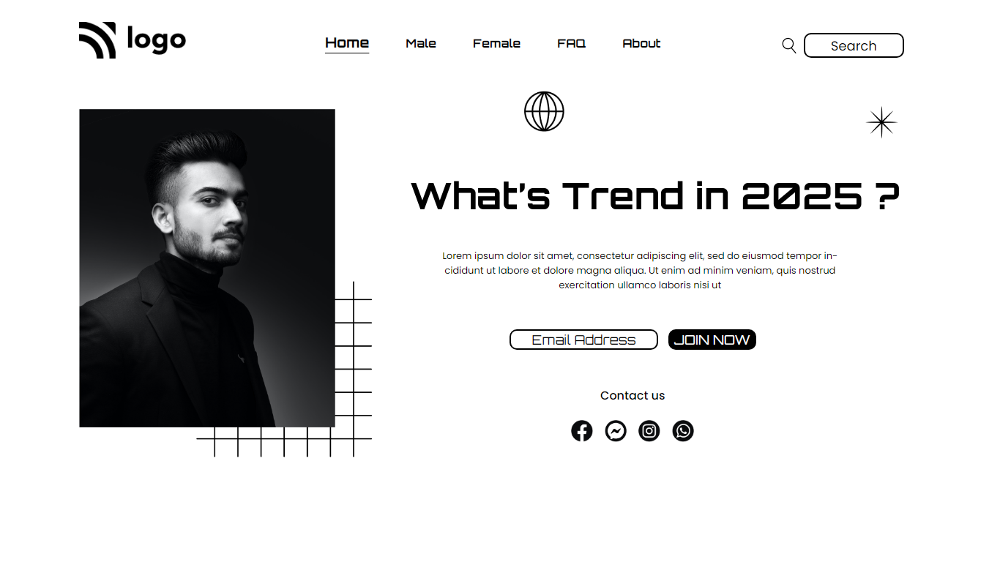

# Project 1 - Street Style Landing Page

  

 

[DEPLOYED WEBSITE LINK](https://fsbproject1.netlify.app/)

## What I learned from this Project?

- I learned about **positions** in css.
- How to make complete website with good images, colors and fonts.

## Completed the project in **4** hours.